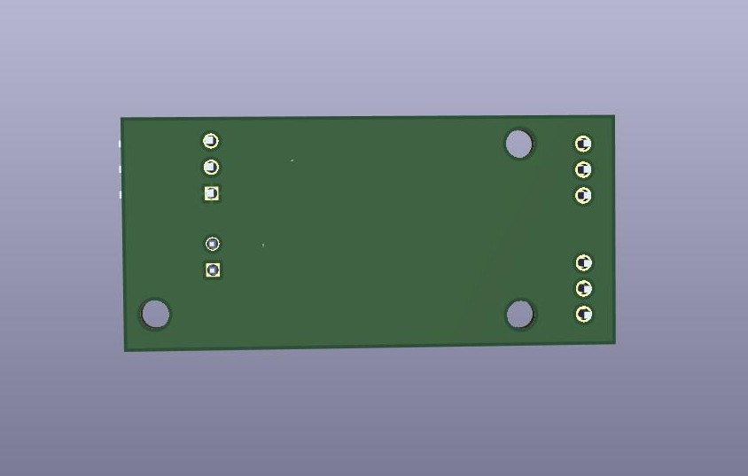

<h1>Solenoid Driver</h1>

Current PCB Revision: 1.0

PCB Part Number: H0001

The solenoid driver uses solid state relays to allow an Arduino Mega 
to control AC powered solenoids with a 5V control signal. The board is 
used by the SDR Hybrid Propulsion team to control their Pancake engine's 
pressurization and main oxidizer valves. 

<b>Working Directory Structure:</b>

   doc: documentation
   
   src: source design files, e.g. schematic and PCB layout files

   lib: libraries for schematic symbols and footprints

   production: files needed for pcb fabrication, e.g. gerbers, profile, drill file

   sim: simulation models/files 

   cad: 3d models
  
   img: images of circuit/footprints for github display 

<h2>3D Model: </h2>

<h2>Schematic:</h2>

<h3>Solenoid Driver</h3>

<h3>Signals and Power</h3>

